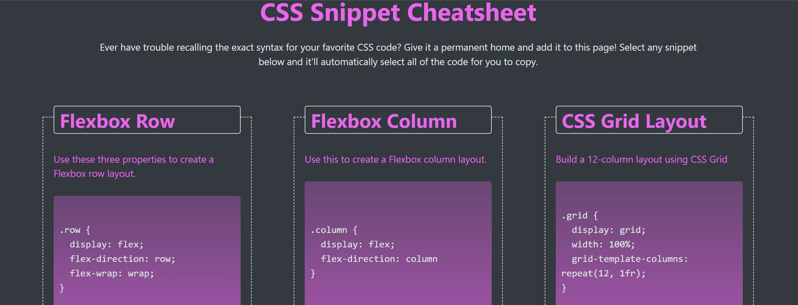

# mini-project-2

This is the second challenge of my UW Coding bootcamp curriculum.

For this challenge, we had to create a webpage that contains a collection of CSS snippets using flexbox and grids.

On this page, you will find semantic HTML, media queries, small animations as well as a use of psedo selectors.

This web-page was made from scratch. No starter code was used.

View the web-page here 

https://noahbrown26.github.io/mini-project-1/
